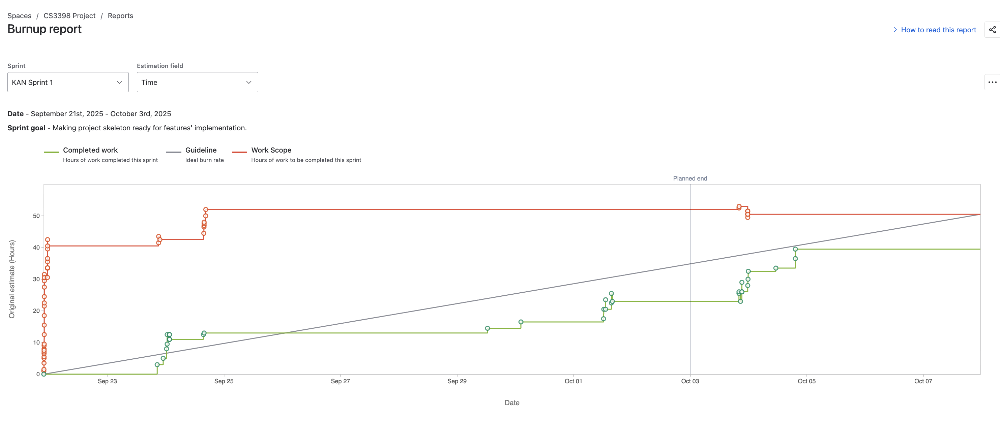

# Sortify
> Sortify is a web app that will organise all of a students' possible documents acting like a organised brain dump. This is where their files/documents are automatically organised for an efficient future reference. This could be used for all of their canvas lecture pdfs, with a feature that summarises those pdfs like a 
continuous chat. We have a team of 5: Saurav Rijal, Shivendra Bhagat, Aaditya Baniya, Abhishek Verma Allamneni and Abheek Pradhan.

## Table of Contents
* [General Info](#general-information)
* [Technologies Used](#technologies-used)
* [Features](#features)
* [Screenshots](#screenshots)
* [Setup](#setup)
* [Usage](#usage)
* [Project Status](#project-status)
* [Room for Improvement](#room-for-improvement)
* [Acknowledgements](#acknowledgements)
* [Contact](#contact)
<!-- * [License](#license) -->

## General Information
- Provide general information about your project here.
- Students especially undergrad tend not to be organised with their documents having to go back and look for them time and again. This makes their work efficient. 
- The purpose of this project is to have a space where a student can find all of their academic materials which are also organised and accessible. 
- We undertook this project because we personally struggle with this and heard concerns about the same from many students like us. We feel this solution would be great for students.
<!-- You don't have to answer all the questions - just the ones relevant to your project. -->

## Technologies Used
- Firebase
- React
- Tailwind CSS
- Python
- Flask or Express

## Features

## Sprint 1

Contributors

  Abheek: "implemented document processing and semantic search capabilities for PDF files"

* **Jira Task: Abheek - Implement document text extraction**
   * KAN-49, [Bitbucket](https://bitbucket.org/cs3398-zabraks-f25/sortify/src/KAN-49-mplement-document-text-extraction/)
* **Jira Task: Abheek - Create PDF embedding model**
   * KAN-91, [Bitbucket](https://bitbucket.org/cs3398-zabraks-f25/sortify/src/KAN-91-create-pdf---embedding-model/)
* **Jira Task: Abheek - Build semantic search functionality**
   * KAN-51, [Bitbucket](https://bitbucket.org/cs3398-zabraks-f25/sortify/src/KAN-51-build-semantic-search-functionali/)

  **Aaditya**: "Setup backend with FastApi and build routes for login/register and dynamic page loading"

* **Jira Task: Aaditya - FastAPI Backend Project Setup**
   * KAN-24, [Bitbucket](https://bitbucket.org/cs3398-zabraks-f25/sortify/commits/branch/feature%2FKAN-24_flask_backend)
* **Jira Task: Aaditya - HomePage, AboutPage**
   * KAN-23, [Bitbucket](https://bitbucket.org/cs3398-zabraks-f25/sortify/commits/branch/feature%2FKAN-23-make-the-api-endpoints-for-restfu)
* **Jira Task: Aaditya - Login and Register Link**
   * KAN-51, [Bitbucket]()

  Shivendra: "Design and develop the dashboard and ui components of the landing page"

* **Jira Task: Shivendra - Create a react app and setup the codebase**
   * KAN-74, [Bitbucket](https://bitbucket.org/cs3398-zabraks-f25/sortify/commits/branch/feature%2FKAN-74-create-signup-form)
* **Jira Task: Shivendra - Start with the ui components for the landing page**
   * KAN-83, [Bitbucket](https://bitbucket.org/cs3398-zabraks-f25/sortify/commits/branch/KAN-83-start-with-the-ui-components-for-)
* **Jira Task: Shivendra - Design and implement dashboard design**
   * KAN-89, [Bitbucket](https://bitbucket.org/cs3398-zabraks-f25/sortify/commits/branch/KAN-89-design-and-implement-dashboard)
* **Jira Task: Shivendra - Add responsiveness and test layout on different screen sizes**
   * KAN-88, [Bitbucket](https://bitbucket.org/cs3398-zabraks-f25/sortify/commits/branch/KAN-88-test-layout-on-different-screens)

   **Saurav**: "Setup Supabase database, Authentication pages and connected the database to the upload form"

* **Jira Task: Saurav - Design and build user profiles table**
   * KAN-20, [Bitbucket](https://bitbucket.org/cs3398-zabraks-f25/sortify/commits/branch/feature%2FKAN-20-1.-design-and-build-file-upload-u)
* **Jira Task: Saurav - Setup supabase and connect with React App**
   * KAN-25, [Bitbucket](https://bitbucket.org/cs3398-zabraks-f25/sortify/commits/branch/feature%2FKAN-25-setup-firebase)
* **Jira Task: Saurav - Connect supabase storage to the upload form**
   * KAN-26, [Bitbucket](https://bitbucket.org/cs3398-zabraks-f25/sortify/commits/branch/KAN-26-3.-connect-supabase-storage-to-th)
* **Jira Task: Saurav - Enable user authentication in Supabase**
   * KAN-27, [Bitbucket](https://bitbucket.org/cs3398-zabraks-f25/sortify/commits/branch/KAN-27-4-enable-user-authentication-in-supabase)
* **Jira Task: Saurav - Enable user authentication in Supabase**
   * KAN-34, [Bitbucket](https://bitbucket.org/cs3398-zabraks-f25/sortify/commits/branch/KAN-34-test-authentication-in-the-vite-app)

## Reports

## Next Steps

**Aaditya**: 

* Storing documents into subfolders online
* Automatically making new sections for different documents
* Document sorting into different folders

**Shivendra**:

**Saurav**:
* Refining RAG for richer output
* Connecting RAG to the frontend
* Connecting the backend to the frontend

**Abheek**:

**Abhisek**

List the ready features here:
- Document organization system, Feature name: Document Organizer, used by student 
- Automated summarizing of files, Feature name: Document Summarizer, used by student 
- Efficient Retrieval of data, Feature name: Document Retriever, used by student

## Setup
What are the project requirements/dependencies? Where are they listed? A requirements.txt or a Pipfile.lock file perhaps? Where is it located?

Proceed to describe how to install / setup one's local environment / get started with the project.

## Usage
- Clone the repo
- Install dependencies through requirements.txt

`
    pip install -r requirements.txt

## Project Status
Project is: _in progress_

## Room for Improvement
Include areas you believe need improvement / could be improved. Also add TODOs for future development.

Room for improvement:
- Deciding on the stack.

To do:
- Making a responsive frontend
- Making a CRUD framework ready first.

## Acknowledgements
Give credit here.
- This project was inspired by all students.
- This project was based on our general problems.
- Many thanks to...

## Contact

<!-- Optional -->
<!-- ## License -->
<!-- This project is open source and available under the [... License](). -->

<!-- You don't have to include all sections - just the one's relevant to your project -->
