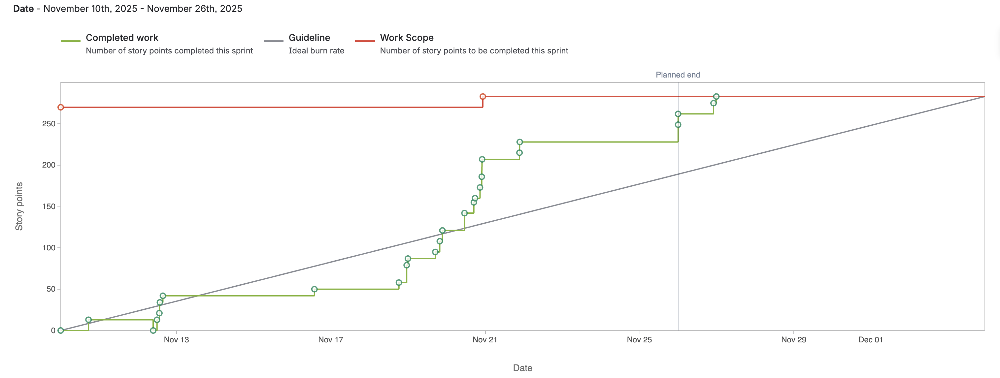

# Sortify
> Sortify is a web app that will organise all of a students' possible documents acting like a organised brain dump. This is where their files/documents are automatically organised for an efficient future reference. This could be used for all of their canvas lecture pdfs, with a feature that summarises those pdfs like a 
continuous chat. We have a team of 5: Saurav Rijal, Shivendra Bhagat, Aaditya Baniya, Abhishek Verma Allamneni and Abheek Pradhan.


## Table of Contents
* [General Info](#general-information)
* [Technologies Used](#technologies-used)
* [Features](#features)
* [Screenshots](#screenshots)
* [Setup](#setup)
* [Usage](#usage)
* [Project Status](#project-status)
* [Room for Improvement](#room-for-improvement)
* [Acknowledgements](#acknowledgements)
* [Contact](#contact)
<!-- * [License](#license) -->


## General Information
- Provide general information about your project here.
- Students especially undergrad tend not to be organised with their documents having to go back and look for them time and again. This makes their work efficient. 
- The purpose of this project is to have a space where a student can find all of their academic materials which are also organised and accessible. 
- We undertook this project because we personally struggle with this and heard concerns about the same from many students like us. We feel this solution would be great for students.
<!-- You don't have to answer all the questions - just the ones relevant to your project. -->


## Technologies Used
- Firebase
- React
- Tailwind CSS
- Python
- Flask or Express

## Features

## Sprint 1

Contributors

  Abheek: "implemented document processing and semantic search capabilities for PDF files"

* **Jira Task: Abheek - Implement document text extraction**
   * KAN-49, [Bitbucket](https://bitbucket.org/cs3398-zabraks-f25/sortify/src/KAN-49-mplement-document-text-extraction/)
* **Jira Task: Abheek - Create PDF embedding model**
   * KAN-91, [Bitbucket](https://bitbucket.org/cs3398-zabraks-f25/sortify/src/KAN-91-create-pdf---embedding-model/)
* **Jira Task: Abheek - Build semantic search functionality**
   * KAN-51, [Bitbucket](https://bitbucket.org/cs3398-zabraks-f25/sortify/src/KAN-51-build-semantic-search-functionali/)

  **Aaditya**: "Setup backend with FastApi and build routes for login/register and dynamic page loading"

* **Jira Task: Aaditya - FastAPI Backend Project Setup**
   * KAN-24, [Bitbucket](https://bitbucket.org/cs3398-zabraks-f25/sortify/commits/branch/feature%2FKAN-24_flask_backend)
* **Jira Task: Aaditya - HomePage, AboutPage**
   * KAN-23, [Bitbucket](https://bitbucket.org/cs3398-zabraks-f25/sortify/commits/branch/feature%2FKAN-23-make-the-api-endpoints-for-restfu)
* **Jira Task: Aaditya - Login and Register Link**
   * KAN-51, [Bitbucket]()

  Shivendra: "Design and develop the dashboard and ui components of the landing page"

* **Jira Task: Shivendra - Create a react app and setup the codebase**
   * KAN-74, [Bitbucket](https://bitbucket.org/cs3398-zabraks-f25/sortify/commits/branch/feature%2FKAN-74-create-signup-form)
* **Jira Task: Shivendra - Start with the ui components for the landing page**
   * KAN-83, [Bitbucket](https://bitbucket.org/cs3398-zabraks-f25/sortify/commits/branch/KAN-83-start-with-the-ui-components-for-)
* **Jira Task: Shivendra - Design and implement dashboard design**
   * KAN-89, [Bitbucket](https://bitbucket.org/cs3398-zabraks-f25/sortify/commits/branch/KAN-89-design-and-implement-dashboard)
* **Jira Task: Shivendra - Add responsiveness and test layout on different screen sizes**
   * KAN-88, [Bitbucket](https://bitbucket.org/cs3398-zabraks-f25/sortify/commits/branch/KAN-88-test-layout-on-different-screens)

   **Saurav**: "Setup Supabase database, Authentication pages and connected the database to the upload form"

* **Jira Task: Saurav - Design and build user profiles table**
   * KAN-20, [Bitbucket](https://bitbucket.org/cs3398-zabraks-f25/sortify/commits/branch/feature%2FKAN-20-1.-design-and-build-file-upload-u)
* **Jira Task: Saurav - Setup supabase and connect with React App**
   * KAN-25, [Bitbucket](https://bitbucket.org/cs3398-zabraks-f25/sortify/commits/branch/feature%2FKAN-25-setup-firebase)
* **Jira Task: Saurav - Connect supabase storage to the upload form**
   * KAN-26, [Bitbucket](https://bitbucket.org/cs3398-zabraks-f25/sortify/commits/branch/KAN-26-3.-connect-supabase-storage-to-th)
* **Jira Task: Saurav - Enable user authentication in Supabase**
   * KAN-27, [Bitbucket](https://bitbucket.org/cs3398-zabraks-f25/sortify/commits/branch/KAN-27-4-enable-user-authentication-in-supabase)
* **Jira Task: Saurav - Enable user authentication in Supabase**
   * KAN-34, [Bitbucket](https://bitbucket.org/cs3398-zabraks-f25/sortify/commits/branch/KAN-34-test-authentication-in-the-vite-app)

 **Abhishek Verma Allamneni**: "Created a page to access user profile settings and update them"

**Jira Task: Saurav - Created a page to access user profile settings**
   * KAN-94, [Bitbucket][(https://bitbucket.org/cs3398-zabraks-f25/sortify/commits/branch/](https://bitbucket.org/%7B48ce9ca7-bb35-4613-92ee-029f8d0e4a21%7D/%7B87739b3b-6b07-4488-ba64-3919c2017f46%7D/pull-requests/5)


## Sprint 2

Contributors

  **Abheek**: "Optimized document processing with streaming, memory management, and progressive loading for better performance"

* **Jira Task: Abheek - Implement streaming PDF processing with document chunking strategy**
   * [KAN-55](https://cs3398-zabraks-fall.atlassian.net/browse/KAN-55), [Bitbucket](https://bitbucket.org/cs3398-zabraks-f25/sortify/src/KAN-55-implement-streaming-pdf-processin/)
   * Commits: [Commit 1](https://bitbucket.org/%7B%7D/%7B87739b3b-6b07-4488-ba64-3919c2017f46%7D/commits/03f34317ba9fe2d51f92bc9414d9b41a57aecd78), [Commit 2](https://bitbucket.org/%7B%7D/%7B87739b3b-6b07-4488-ba64-3919c2017f46%7D/commits/ec9f6c68e6d587654ff6eec6112b9fe75fdebe45), [Commit 3](https://bitbucket.org/%7B%7D/%7B87739b3b-6b07-4488-ba64-3919c2017f46%7D/commits/66738e656742313b1b183d3286652f15e21696c3)
* **Jira Task: Abheek - Build memory pool management system with background job queue**
   * [KAN-56](https://cs3398-zabraks-fall.atlassian.net/browse/KAN-56), [Bitbucket](https://bitbucket.org/cs3398-zabraks-f25/sortify/src/KAN-56-build-memory-pool-management-syst/)
   * Commits: [Commit 1](https://bitbucket.org/%7B%7D/%7B87739b3b-6b07-4488-ba64-3919c2017f46%7D/commits/f65483685eb9835d8b8f2df98dcd741e08d2a6ca), [Commit 2](https://bitbucket.org/%7B%7D/%7B87739b3b-6b07-4488-ba64-3919c2017f46%7D/commits/371a042734ca07647c8c3a6e4b2ecf477d58b67f), [Commit 3](https://bitbucket.org/%7B%7D/%7B87739b3b-6b07-4488-ba64-3919c2017f46%7D/commits/f51e35d467e8bd2ff99c0eb92ee6674d5cce00d6), [Commit 4](https://bitbucket.org/%7B%7D/%7B87739b3b-6b07-4488-ba64-3919c2017f46%7D/commits/6cf8e1d87ad714c58b2671e5756c9878fbc51131), [Commit 5](https://bitbucket.org/%7B%7D/%7B87739b3b-6b07-4488-ba64-3919c2017f46%7D/commits/677c63039b04c617188244fe8973cadeb3ee3726)
* **Jira Task: Abheek - Add progressive loading and lazy evaluation for document content display**
   * [KAN-57](https://cs3398-zabraks-fall.atlassian.net/browse/KAN-57), [Bitbucket](https://bitbucket.org/cs3398-zabraks-f25/sortify/src/KAN-57-add-progressive-loading-and-lazy-/)
   * Commits: [Commit 1](https://bitbucket.org/%7B%7D/%7B87739b3b-6b07-4488-ba64-3919c2017f46%7D/commits/e7b4461c2798702762eef37ce62890d815f89832), [Commit 2](https://bitbucket.org/%7B%7D/%7B87739b3b-6b07-4488-ba64-3919c2017f46%7D/commits/975bffd3b8fd171bbe2d2e381906db61c7ce01a4), [Commit 3](https://bitbucket.org/%7B%7D/%7B87739b3b-6b07-4488-ba64-3919c2017f46%7D/commits/98e04d6c3e99740001c868c181f2b6cd43ceb549), [Commit 4](https://bitbucket.org/%7B%7D/%7B87739b3b-6b07-4488-ba64-3919c2017f46%7D/commits/0fa3f33e84ae1946cd60ced797d440f46ca592e8)


  **Aaditya**: "Updated and fixed RAG and properly organized and categorized documents into specific folders"

* **Jira Task: Aaditya - Display "No documents found" message when search returns empty results.**
   * KAN-21 [Bitbucket](https://bitbucket.org/cs3398-zabraks-f25/sortify/src/7fa2624fe8d45a121f609d4a63f6804092fd864e/?at=feature%2FKAN-21-display-no-documents-found)
* **Jira Task: Aaditya - Categorizing documents to their respective folders**
   * KAN-22 [Bitbucket](https://bitbucket.org/cs3398-zabraks-f25/sortify/src/1b98996c4edba5898ec6fb26608d0d46a00c0737/?at=feature%2FKAN-22-assign-document-to-folder)
* **Jira Task: Aaditya - Adding a working search bar which filters from RAG**
   * KAN-8, [Bitbucket](https://bitbucket.org/cs3398-zabraks-f25/sortify/src/655a64102c418ca388e1a7359497a399748f9cb0/?at=feature%2FKAN-8-add-a-working-search-bar)
* **Jira Task: Aaditya - Showing filtered documents in real-time while typing**
   * KAN-14, [Bitbucket](https://bitbucket.org/cs3398-zabraks-f25/sortify/src/64417d1aa73bcf75dc399bfcf59f779bdf6bd94f/?at=feature%2FKAN-14-show-filtered-results-in-real-tim)
* **Jira Task: Aaditya - Implementing client-side filteration to filter documents**
   * KAN-13, [Bitbucket](https://bitbucket.org/cs3398-zabraks-f25/sortify/src/f15f56a83eee0528c57cb56e34afc750364ab0f6/?at=feature%2FKAN-13-implement-simple-client-side-filt)

  Shivendra: "As a student, I want to have a smooth user experience of the landing page", 
             " As a student, I want to access the chatbot feature"

* **Jira Task: Shivendra - Create the ui of the chatbot**
   * KAN-85, [Bitbucket](https://bitbucket.org/cs3398-zabraks-f25/sortify/commits/branch/feature%2FKAN-85-create-the-ui-of-the-chatbot)
* **Jira Task: Shivendra - Add user profile section to the landing page**
   * KAN-81, [Bitbucket](https://bitbucket.org/cs3398-zabraks-f25/sortify/commits/branch/KAN-81-add-user-profile-section)
* **Jira Task: Shivendra - Restructure files and refactor the CSS of dashboard**
   * KAN-78, [Bitbucket](https://bitbucket.org/cs3398-zabraks-f25/sortify/commits/branch/feature%2FKAN-78-refactor-the-css-of-dashboard)
* **Jira Task: Shivendra - Trigger the chatbot feature upon clicking AI Search**
   * KAN-84, [Bitbucket](https://bitbucket.org/cs3398-zabraks-f25/sortify/commits/branch/KAN-84-trigger-the-chatbot-feature-upon-clicking-AI-Search)

   **Saurav**: "Set up folder updates, syncing, and renaming, and made sure the frontend connects properly with the backend."

* **Jira Task: Saurav - Make sure the frontend retrieves data successfully from the backend endpoint**
   * KAN-79, [Bitbucket](https://bitbucket.org/cs3398-zabraks-f25/sortify/branch/feature/KAN-79-make-sure-the-chatbot-retrieves-d)
* **Jira Task: Saurav - Add categorization and document services**
   * KAN-28, [Bitbucket](https://bitbucket.org/cs3398-zabraks-f25/sortify/branch/KAN-28-when-a-group-name-changes-or-two-)
* **Jira Task: Saurav - Created background tasks and added logic to fetch categories**
   * KAN-30, [Bitbucket](https://bitbucket.org/cs3398-zabraks-f25/sortify/branch/feature/KAN-30-create-a-background-%E2%80%9Cdirectory-sy)
* **Jira Task: Saurav - Enable uploads being saved to database correctly and notification pop-up**
   * KAN-33, [Bitbucket](https://bitbucket.org/cs3398-zabraks-f25/sortify/branch/KAN-33-implement-a-file-placement-hook-t)


## Sprint 3

Contributors

  **Abheek**: "Optimized embedding models, chunking algorithms, and implemented comprehensive unit testing"

* **Jira Task: Abheek - Choose better embedding model**
   * [KAN-104](https://cs3398-zabraks-fall.atlassian.net/browse/KAN-104), [Bitbucket](https://bitbucket.org/cs3398-zabraks-f25/sortify/src/KAN-104-choose-better-embedding-model-an/)
* **Jira Task: Abheek - Optimize chunking logic**
   * [KAN-103](https://cs3398-zabraks-fall.atlassian.net/browse/KAN-103), [Bitbucket](https://bitbucket.org/cs3398-zabraks-f25/sortify/src/KAN-103-optimize-chunking-logic/)
* **Jira Task: Abheek - Choose algorithm for chunking logic**
   * [KAN-105](https://cs3398-zabraks-fall.atlassian.net/browse/KAN-105), [Bitbucket](https://bitbucket.org/cs3398-zabraks-f25/sortify/src/KAN-105-choose-algorithm-for-chunking-lo/)
* **Jira Task: Abheek - Optimize the embedding model**
   * [KAN-100](https://cs3398-zabraks-fall.atlassian.net/browse/KAN-100), [Bitbucket](https://bitbucket.org/cs3398-zabraks-f25/sortify/src/KAN-100-optimize-the-embedding-model/)
* **Jira Task: Abheek - Unit test planning**
   * [KAN-113](https://cs3398-zabraks-fall.atlassian.net/browse/KAN-113), [Bitbucket](https://bitbucket.org/cs3398-zabraks-f25/sortify/src/KAN-113-unit-test-planning/)
* **Jira Task: Abheek - Unit testing for chunking logic**
   * [KAN-111](https://cs3398-zabraks-fall.atlassian.net/browse/KAN-111), [Bitbucket](https://bitbucket.org/cs3398-zabraks-f25/sortify/src/KAN-111-unit-testing-for-chunking-logic/)
* **Jira Task: Abheek - Unit testing front-backend connection**
   * [KAN-112](https://cs3398-zabraks-fall.atlassian.net/browse/KAN-112), [Bitbucket](https://bitbucket.org/cs3398-zabraks-f25/sortify/src/KAN-112-unit-testing-front-backend-connection/)

  **Aaditya**: ""

* **Jira Task: Aaditya -Testing unit tests**
   * KAN-18 [Bitbucket](https://bitbucket.org/cs3398-zabraks-f25/sortify/branch/feature/KAN-18-testing-unit-tests)
* **Jira Task: Aaditya -Testing plan tasks**
   * KAN-31 [Bitbucket](https://bitbucket.org/cs3398-zabraks-f25/sortify/branch/feature/KAN-31-allow-users-to-select-multiple-ta)
* **Jira Task: Aaditya -Make chatbot backend and connect chatbot with Gemini API pro**
   * KAN-16, [Bitbucket](https://bitbucket.org/cs3398-zabraks-f25/sortify/branch/feature/KAN-16-connect-chatbot-with-gemini-api-p)
* **Jira Task: Aaditya -Generating a category related image for new categories**
   * KAN-32, [Bitbucket](https://bitbucket.org/cs3398-zabraks-f25/sortify/branch/KAN-32-adding-a-functionality-to-drop-pd)
* **Jira Task: Aaditya -Add a feature to upload pdf files into chatbot**
   * KAN-12, [Bitbucket](https://bitbucket.org/cs3398-zabraks-f25/sortify/branch/feature/KAN-12-connect-chatbot-backend-with-fron)
* **Jira Task: Aaditya -Refactoring the chatbot UI to be more responsive on smaller screens**
   * KAN-15, [Bitbucket](https://bitbucket.org/cs3398-zabraks-f25/sortify/branch/KAN-15-refactoring-the-chatbot-ui-to-be-)
* **Jira Task: Aaditya -Testing the chatbot using unit test cases**
   * KAN-10, [Bitbucket](https://bitbucket.org/cs3398-zabraks-f25/sortify/branch/KAN-10-testing-the-chatbot-using-unit-te)

  **Shivendra**: "1. As a student, I want to have a smooth user experience of the landing page, As a student, I want a dashboard that shows all my documents so that I can navigate through them easily, As a user, I want the site to work well on mobile so that I can use it anywhere."

* **Jira Task: Shivendra -Planning unit tests**
   * KAN-109, [Bitbucket](https://bitbucket.org/cs3398-zabraks-f25/sortify/commits/branch/KAN-109-planning-unit-tests)
* **Jira Task: Shivendra -Refactor and update the CSS design of the landing page**
   * KAN-80, [Bitbucket](https://bitbucket.org/cs3398-zabraks-f25/sortify/commits/branch/KAN-80-refactor-and-update-the-css)
* **Jira Task: Shivendra -Implementation of unit tests**
   * KAN-110, [Bitbucket](https://bitbucket.org/cs3398-zabraks-f25/sortify/commits/branch/KAN-110-implementation-of-unit-tests)
* **Jira Task: Shivendra -Develop and upload the logo for the project**
   * KAN-40, [Bitbucket](https://bitbucket.org/cs3398-zabraks-f25/sortify/commits/branch/KAN-40-develop-and-upload-the-logo)
* **Jira Task: Shivendra -Refactor the Profile page section and break down into smaller reusable components**
   * KAN-87, [Bitbucket](https://bitbucket.org/cs3398-zabraks-f25/sortify/commits/branch/KAN-87-refactor-the-profile-page-section)


   **Saurav**: "Work on integrating database with category assignment, changes, notifications and fetching information."

* **Jira Task: Saurav - Design database schema for efficient storage and easier retrieval**
   * KAN-90, [Bitbucket](https://bitbucket.org/cs3398-zabraks-f25/%7B87739b3b-6b07-4488-ba64-3919c2017f46%7D/branch/feature/KAN-90-work-on-having-better-database-sc)
* **Jira Task: Saurav - Improve accuracy of categories assignment and fix the notification toast**
   * KAN-2, [Bitbucket](https://bitbucket.org/cs3398-zabraks-f25/%7B87739b3b-6b07-4488-ba64-3919c2017f46%7D/branch/feature/KAN-2-work-on-better-having-better-accur)
   * KAN-2, [Bitbucket](https://bitbucket.org/cs3398-zabraks-f25/%7B87739b3b-6b07-4488-ba64-3919c2017f46%7D/branch/KAN-2-work-on-better-having-better-accur)

* **Jira Task: Saurav -Fix the state changes on drag and drop feature**
   * KAN-3, [Bitbucket](https://bitbucket.org/cs3398-zabraks-f25/%7B87739b3b-6b07-4488-ba64-3919c2017f46%7D/branch/feature/KAN-3-fix-the-state-changes-on-drag-and-)
* **Jira Task: Saurav - Detects auplicate files and assigns a unique name**
   * KAN-44, [Bitbucket](https://bitbucket.org/cs3398-zabraks-f25/%7B87739b3b-6b07-4488-ba64-3919c2017f46%7D/branch/KAN-44-smart-duplicate-detection-as-a-st)
* **Jira Task: Saurav - Display all files when a user clicks on a particular category**
      * KAN-36, [Bitbucket](https://bitbucket.org/cs3398-zabraks-f25/%7B87739b3b-6b07-4488-ba64-3919c2017f46%7D/branch/KAN-36-allow-users-to-click-a-course-nam)
* **Jira Task: Saurav - Implement loading spinners, error messages if the API call fails, and a friendly message if no documents exist.**
      * KAN-42, [Bitbucket](https://bitbucket.org/cs3398-zabraks-f25/%7B87739b3b-6b07-4488-ba64-3919c2017f46%7D/branch/KAN-42-implement-loading-spinners-error-)
* **Jira Task: Saurav -Unit Tests for features and results**
      * KAN-107, [Bitbucket](https://bitbucket.org/cs3398-zabraks-f25/%7B87739b3b-6b07-4488-ba64-3919c2017f46%7D/branch/KAN-107-test-execution-and-results)

  Abhishek Verma Allamneni: ""

* **Jira Task: Abhishek -**
   * KAN-64, [Bitbucket](link)


## Reports



## Setup

### Prerequisites
- Python 3.11 or higher
- pip (Python package manager)

### Dependencies
The project dependencies are listed in `requirements.txt` located at:
```
sortify/embedding/requirements.txt
```

Key dependencies include:
- **FastAPI** (0.117.1) - Web framework for building the API
- **Uvicorn** (0.37.0) - ASGI server for running FastAPI
- **Google Generative AI** (0.8.5) - For AI-powered features
- **Sentence Transformers** (5.1.1) - For document embeddings and semantic search
- **PyTorch** (2.8.0) - Deep learning framework
- **pypdf** (5.2.0) - For PDF processing
- **Supabase** - Database and authentication (configured via environment variables)

### Installation Steps

1. **Clone the repository**
   ```bash
   git clone <repository-url>
   cd sortify
   ```

2. **Set up Python virtual environment** (recommended)
   ```bash
   cd embedding
   python -m venv venv
   source venv/bin/activate  # On Windows: venv\Scripts\activate
   ```

3. **Install Python dependencies**
   ```bash
   pip install -r requirements.txt
   ```

4. **Configure environment variables**
   - Copy the `.env` file to `embedding/.env` and configure the following:
     - `GOOGLE_API_KEY` - Your Google AI API key
     - `SUPABASE_URL` - Your Supabase project URL
     - `SUPABASE_KEY` - Your Supabase API key

5. **Install frontend dependencies**
   ```bash
   cd ../sortify_app
   npm install
   ```


## Usage

### Running the Backend (Python/FastAPI)

1. Navigate to the embedding directory:
   ```bash
   cd sortify/embedding
   ```

2. Activate your virtual environment:
   ```bash
   source venv/bin/activate  # On Windows: venv\Scripts\activate
   ```

3. Start the FastAPI server:
   ```bash
   uvicorn app:app --reload
   ```
   The API will be available at `http://localhost:8000`

### Running the Frontend (React/Vite)

1. Navigate to the sortify_app directory:
   ```bash
   cd sortify/sortify_app
   ```

2. Start the development server:
   ```bash
   npm run dev
   ```
   The application will be available at `http://localhost:5173`

### Using the Application

1. **Sign up/Login** - Create an account or log in with your credentials
2. **Upload Documents** - Upload your PDF files and they will be automatically organized
3. **Search** - Use the AI-powered search to find specific content across all your documents
4. **Chat** - Interact with the chatbot to ask questions about your uploaded documents
5. **Organize** - Documents are automatically categorized into folders based on their content


## Project Status
Project is: _in progress_


## Room for Improvement
Include areas you believe need improvement / could be improved. Also add TODOs for future development.

Room for improvement:
- Deciding on the stack.

To do:
- Making a responsive frontend
- Making a CRUD framework ready first.


## Acknowledgements
Give credit here.
- This project was inspired by all students.
- This project was based on our general problems.
- Many thanks to...


## Contact


<!-- Optional -->
<!-- ## License -->
<!-- This project is open source and available under the [... License](). -->

<!-- You don't have to include all sections - just the one's relevant to your project -->
